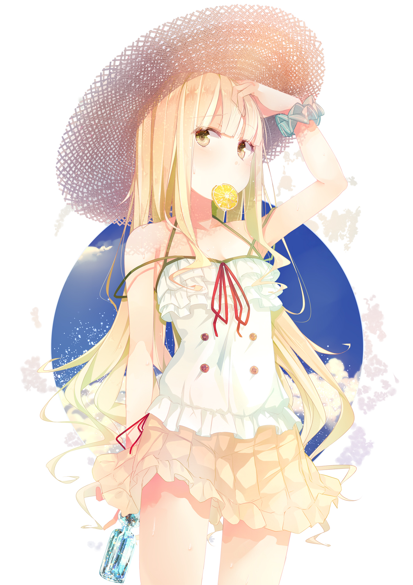

<html>
<link rel="stylesheet" href="fishcake.css">

<meta name="viewport" content="width=devices-width, initial-scale=1">

  
  

    <h1>
      Just a quick test on the html basics
    </h1>

<!-- Tab links -->

 <button class="tablinks" onclick="openCat(event, 'Fishcake')"><b>Timetable</b></button>
 <button class="tablinks" onclick="openCat(event, 'Rofl')"><b>Website</b></button>
 <button class="tablinks" onclick="openCat(event, 'Wsraw')"><b>Discord<b></button>

<!-- Tab content -->

   [x]
 <h3>School Timetable</h3>
 <table align="center" border="2">
 <tr>
   <th>Monday</th>
   <th>PE</th>
   <th>11B</th>
   <th>11A</th>
   <th>Co-Arts</th>
 </tr>
 <tr>
   <th>Tuesday</th>
   <th>Geography</th>
   <th>Physics</th>
   <th>Breaktime</th>
   <th>Mandarin</th>
   <th>PHSE</th>
 </tr>
 <tr>
   <th>Wednesday</th>
   <th>PE</th>
   <th>11B</th>
   <th>11A</th>
   <th>Co-Arts</th>
 </tr>
 <tr>
   <th>Thursday</th>
   <th>PE</th>
   <th>11B</th>
   <th>11A</th>
   <th>Co-Arts</th>
 </tr>
 <tr>
   <th>Friday</th>
   <th>PE</th>
   <th>11B</th>
   <th>11A</th>
   <th>Co-Arts</th>
 </tr>
 </table>

   [x]
 <h3>It's on Github!</h3>
 
1. Cute foxes are cool

<picture>

  </picture>
  
2.
<a href="https://daskpfoundation.github.io/KytZuneia/Release%204.2.3/De_Home.html">You can visit the site here (Release 4.2.3)</a>
  

  
*
<a href="https://github.com/DasKPFoundation/KytZuneia/releases">Release</a>

   [x]
 <h3>My Discord Server</h3>
 <iframe src="https://discordapp.com/widget?id=456459901951279108&theme=dark" width="350" height="500" allowtransparency="true" frameborder="0"></iframe>

  

    
Here's a cute picture

      

<h1><u>Rofl</u></h1>
  
Kitsune Kon Kon

